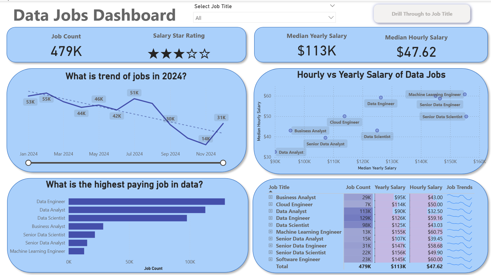

# 📊 Data Jobs Dashboard — Power BI Projects

Welcome to my Power BI portfolio! This repository showcases two Power BI projects I created to analyze and visualize trends in the global data job market.

## 🧠 Project Overview

These dashboards were designed to demonstrate my skills in data wrangling, visualization, and interactive reporting using Power BI. The goal was to provide insights into the **demand for data-related jobs across regions**, job titles, and required skills.

## 📁 Files Included

- `Data_Jobs_Dashboard.pbix`: Initial version of the dashboard with basic insights.
- `Data_Jobs_Dashboard_2.0.pbix`: Enhanced version with improved visuals and interactivity.

## ✨ Features

- Top job titles and their global distribution
- Skill demand trends across various roles
- Regional insights and hiring concentration
- Filters and slicers for dynamic exploration
- Clean, modern layout designed for usability

## 🛠️ Tools & Skills Used

- **Power BI Desktop**
- Data modeling
- DAX for calculated columns/measures
- Interactive visuals and custom tooltips
- Dashboard layout and UX design

## 📌 Key Insights

- Certain job titles like *Data Analyst*, *Data Engineer*, and *Machine Learning Engineer* dominate the listings globally.
- Skills such as Python, SQL, and Power BI appear most frequently.
- Job demand is highly concentrated in tech hubs like the US, UK, and parts of Asia.

## 🌐 Live Dashboards

Explore the interactive Power BI dashboards below. These projects showcase insights into global data job trends, skills demand, and hiring distribution.

> ⚠️ **Note:** These links may expire after the trial Power BI Pro period ends.

### 🔹 Version 1.0  
👉 [View Data Jobs Dashboard](https://app.powerbi.com/reportEmbed?reportId=812a880f-65fd-4e3f-afdc-3c2794698b04&autoAuth=true&ctid=5ba5ef5e-3109-4e77-85bd-cfeb0d347e82)

### 🔹 Version 2.0 (Enhanced Layout & Interactions)  
👉 [View Data Jobs Dashboard 2.0](https://app.powerbi.com/reportEmbed?reportId=ed595ca0-016b-4a5b-8a1e-62fac4656d4f&autoAuth=true&ctid=5ba5ef5e-3109-4e77-85bd-cfeb0d347e82)

## 📷 Dashboard Preview

  
## 🔗 How to Use

To explore the dashboard offline:
1. Download the `.pbix` file of your choice.
2. Open it using **Power BI Desktop**.
3. Navigate through the report tabs and use filters to explore different insights.

---

Feel free to reach out or connect with me if you'd like to learn more about the project!
